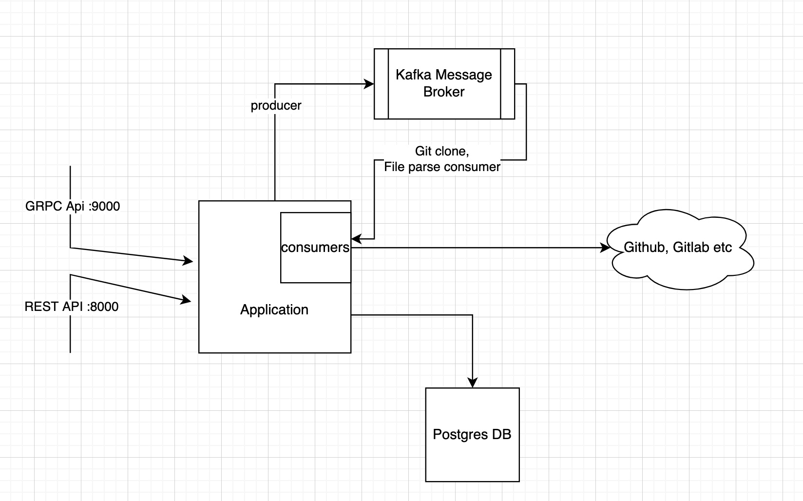

## Problem
Aim of this project is to make any codebase or repository safe and protect them from attacker.
At very high level, it can scan any repository, do the static analayis over it and produce the report.

## Infrastructure

## Solution
I wanted the final solution to be fault-tolerant and scalable, and decided to do all the processing asynchronously 
and in retryable manner.
We have an application which exposes all the needed apis [openapi.yaml](openapi.yaml).
Once the user creates a repository and create a scan against it, the application will create a scan request and publish it to kafka.
Clone consumer will consume the message, clone the repository, read all regular files content and publish back to kafka on another topic.
File content consumer will consume the message, parse the content and will look for secrets, and update in db.
I am storing the how many files we need to scan in db, and once all the files are scanned, I am updating the scan status to success.

## How to run
1. Clone the repo
2. Run `docker-compose up`
It will start the application, kafka, zookeeper, postgres.
3. Config are under [configs/config.yaml](configs/config.yaml), GRPC port is 9000, HTTP port is 8000
4. Explore the swagger ui at [http://localhost:8000/q/swagger-ui](http://localhost:8000/q/swagger-ui) and try the apis.

### To run unit tests
Run `go test ./...` in root directory

## Migration
I have created a db migration utility, which will run the migrations under [migrations](migrations).
For that i am using https://github.com/pressly/goose

## Framework
I am using Kraots, which is Go framework for building microservices....
https://go-kratos.dev/en/
